# Entity Relationship Diagram (ERD)

## Database Schema - Hackathon Social Platform

```mermaid
erDiagram
    User ||--o{ UserProfile : "has one"
    User ||--o{ Post : "authors"
    User ||--o{ Comment : "authors"
    User ||--o{ Event : "hosts"
    User ||--o{ Booking : "books events"
    User ||--o{ SellingPost : "sells (seller)"
    User ||--o{ SellingPost : "buys (buyer)"
    User ||--o{ BuyingPost : "creates wanted ads"
    User ||--o{ Listing : "creates auctions"
    User ||--o{ Bid : "places bids"
    User ||--o{ MarketComment : "writes comments"
    User ||--o{ Notification : "receives (recipient)"
    User ||--o{ Notification : "sends (sender)"
    
    Post ||--o{ Comment : "has many"
    Event ||--o{ Booking : "has many"
    SellingPost ||--o{ MarketComment : "has many"
    Listing ||--o{ Bid : "receives many"
    Listing ||--o| Bid : "accepts one (winning)"
    Listing ||--o| Notification : "related to"
    SellingPost ||--o| Notification : "related to"

    User {
        int id PK
        string username UK
        string email UK
        string password
        string first_name
        string last_name
        datetime date_joined
        boolean is_active
        boolean is_staff
        boolean is_superuser
    }

    UserProfile {
        int id PK
        int user_id FK "OneToOne"
        text bio "max_length=500, blank"
        string location "CharField max_length=30, blank"
        date birth_date "null, blank"
        CloudinaryField profile_picture "null, blank"
        string website "URLField, blank"
        string github "URLField, blank"
        string twitter "URLField, blank"
        string linkedin "URLField, blank"
        string security_question_1 "CharField max_length=200, choices"
        string security_answer_1 "CharField max_length=100"
        string security_question_2 "CharField max_length=200, choices"
        string security_answer_2 "CharField max_length=100"
        string security_question_3 "CharField max_length=200, choices"
        string security_answer_3 "CharField max_length=100"
        datetime date_joined "default=now"
        boolean is_verified "default=False"
        datetime last_active "auto_now"
    }

    Post {
        int id PK
        string title "CharField max_length=200"
        text content "TextField"
        CloudinaryField image "blank, null"
        int author_id FK "CASCADE"
        datetime created_on "auto_now_add"
        datetime updated_on "auto_now"
        boolean accepted "default=False"
    }

    Comment {
        int id PK
        int post_id FK "CASCADE"
        int author_id FK "CASCADE"
        text content "TextField"
        datetime created_on "auto_now_add"
        datetime updated_on "auto_now"
        boolean accepted "default=False"
    }

    Event {
        int id PK
        string title "CharField max_length=100"
        string slug "CharField max_length=200, unique, blank"
        datetime date "DateTimeField"
        string location "CharField max_length=150"
        int host_id FK "CASCADE"
        text description "TextField, blank"
        CloudinaryField featured_image "default=placeholder"
        datetime created_on "auto_now_add"
        int status "choices: 0=Draft, 1=Published, default=0"
        datetime updated_on "auto_now"
    }

    Booking {
        int id PK
        int user_id FK "CASCADE"
        int event_id FK "CASCADE"
        datetime booked_at "auto_now_add"
    }

    SellingPost {
        int id PK
        string title "CharField max_length=200"
        text description "TextField"
        decimal price "DecimalField max_digits=10, decimal_places=2"
        int seller_id FK "CASCADE"
        int buyer_id FK "SET_NULL, null, blank"
        boolean is_sold "default=False"
        datetime created_at "auto_now_add"
        CloudinaryField image "default=placeholder"
    }

    BuyingPost {
        int id PK
        string title "CharField max_length=200"
        text description "TextField"
        decimal min_price "DecimalField max_digits=10, decimal_places=2"
        int buyer_id FK "CASCADE"
        datetime created_at "auto_now_add"
        CloudinaryField image "default=placeholder"
    }

    MarketComment {
        int id PK
        int post_id FK "CASCADE"
        int author_id FK "CASCADE"
        text content "TextField"
        datetime created_at "auto_now_add"
    }

    Listing {
        int id PK
        int seller_id FK "CASCADE"
        string title "CharField max_length=255"
        text description "TextField, blank"
        decimal starting_price "DecimalField max_digits=12, decimal_places=2, default=0"
        decimal reserve_price "DecimalField max_digits=12, decimal_places=2, null, blank"
        decimal min_increment "DecimalField max_digits=12, decimal_places=2, default=1.00"
        datetime ends_at "null, blank"
        decimal current_price "DecimalField max_digits=12, decimal_places=2, null, blank"
        CloudinaryField image "default=placeholder"
        boolean is_sold "default=False"
        int accepted_bid_id FK "SET_NULL, null, blank"
        datetime created_at "auto_now_add"
        datetime updated_at "auto_now"
    }

    Bid {
        int id PK
        int listing_id FK "CASCADE"
        int bidder_id FK "CASCADE"
        decimal amount "DecimalField max_digits=12, decimal_places=2"
        datetime created_at "auto_now_add"
    }

    Notification {
        int id PK
        int recipient_id FK "CASCADE"
        int sender_id FK "CASCADE"
        string notification_type "CharField max_length=20, choices: purchase, bid, bid_accepted"
        text message "TextField"
        int related_listing_id FK "CASCADE, null, blank"
        int related_selling_post_id FK "CASCADE, null, blank"
        boolean is_read "default=False"
        datetime created_at "auto_now_add"
    }
```

## Relationship Details

### User Relationships
- **User → UserProfile**: One-to-One (CASCADE)
- **User → Post**: One-to-Many as author (CASCADE)
- **User → Comment**: One-to-Many as author (CASCADE)
- **User → Event**: One-to-Many as host (CASCADE)
- **User → Booking**: One-to-Many as attendee (CASCADE)
- **User → SellingPost**: One-to-Many as seller (CASCADE)
- **User → SellingPost**: One-to-Many as buyer (SET_NULL)
- **User → BuyingPost**: One-to-Many as buyer (CASCADE)
- **User → Listing**: One-to-Many as seller (CASCADE)
- **User → Bid**: One-to-Many as bidder (CASCADE)
- **User → MarketComment**: One-to-Many as author (CASCADE)
- **User → Notification**: One-to-Many as recipient (CASCADE)
- **User → Notification**: One-to-Many as sender (CASCADE)

### Feed App Relationships
- **Post → Comment**: One-to-Many (CASCADE)
  - A post can have multiple comments
  - Deleting a post deletes all its comments

### Events App Relationships
- **Event → Booking**: One-to-Many (CASCADE)
  - An event can have multiple bookings
  - Deleting an event deletes all bookings

### Marketplace App Relationships
- **SellingPost → MarketComment**: One-to-Many (CASCADE)
  - A selling post can have multiple comments
  - Deleting a post deletes all comments

- **Listing → Bid**: One-to-Many (CASCADE)
  - A listing can receive multiple bids
  - Deleting a listing deletes all bids

- **Listing → Bid**: One-to-One as accepted_bid (SET_NULL)
  - A listing can have one accepted (winning) bid
  - Deleting the bid doesn't delete the listing

- **Listing → Notification**: One-to-Many (CASCADE, optional)
  - Notifications can reference a specific listing
  
- **SellingPost → Notification**: One-to-Many (CASCADE, optional)
  - Notifications can reference a specific selling post

## Key Features

### Ordering
- **Post**: `-created_on` (newest first)
- **Comment**: `created_on` (oldest first)
- **Event**: `-date` (upcoming first)
- **Booking**: `booked_at` (chronological)
- **Listing**: `-created_at` (newest first)
- **Bid**: `-amount, created_at` (highest first, then earliest)
- **Notification**: `-created_at` (newest first)

### Indexes
- **Listing**: 
  - `-created_at` for listing queries
  - `ends_at` for auction expiry checks
  
- **Bid**:
  - `listing, -amount` for finding highest bids
  - `bidder, -created_at` for user bid history

### Unique Constraints
- **User**: `username`, `email`
- **UserProfile**: `user_id` (one-to-one)
- **Event**: `slug`

### Choices/Enums
- **Event.status**: 0 (Draft), 1 (Published)
- **Notification.notification_type**: 'purchase', 'bid', 'bid_accepted'
- **UserProfile.security_questions**: 8 predefined security questions

### CloudinaryField Usage
All image fields use Cloudinary for cloud storage:
- `UserProfile.profile_picture`
- `Post.image`
- `Event.featured_image`
- `SellingPost.image`
- `BuyingPost.image`
- `Listing.image`

## Business Logic Notes

1. **Auction System (Listing/Bid)**:
   - Sellers cannot bid on their own listings
   - Bids must meet minimum increment requirements
   - Winning bid is tracked via `accepted_bid` FK
   - `current_price` denormalized for performance

2. **Marketplace Transactions**:
   - SellingPosts can be marked as sold
   - Buyer assigned via FK when purchase committed
   - Notifications created for purchases and bid acceptances

3. **Content Moderation**:
   - Posts and Comments have `accepted` field for moderation
   - Events have Draft/Published status

4. **Security**:
   - Three security questions for password recovery
   - Answers stored in UserProfile

5. **Social Features**:
   - User profiles track last activity
   - Multiple social media links supported
   - Event bookings track attendance
