#### Features

##### Events
| Feature | Description | Image |
| :---: | :----: | :------: |
| Events | Show all events in an event feed | 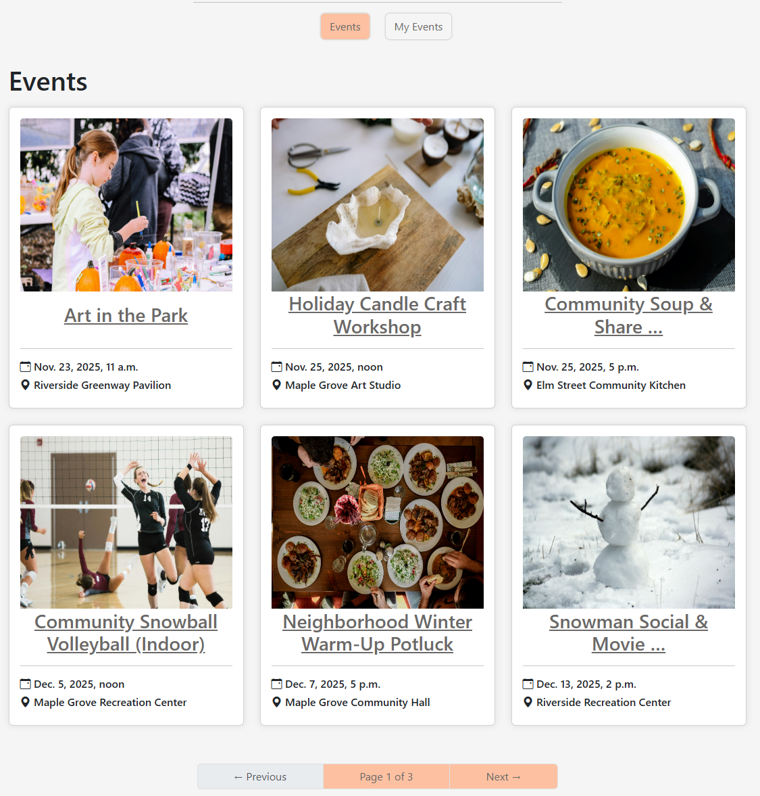 |
| Event Detail | Show event details including date, time, location and description |  |
| Event - Booking | User can press the book button to book an event, which then shows a confimartion message at the top of the screen | 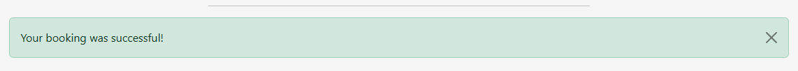 |
| Event - Cancel | User can cancel their booked event | 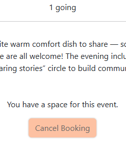 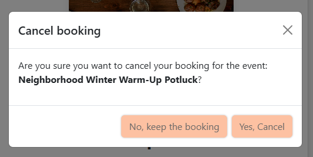 |
| My Events - Host Tab | Show users hosted published and past published events | 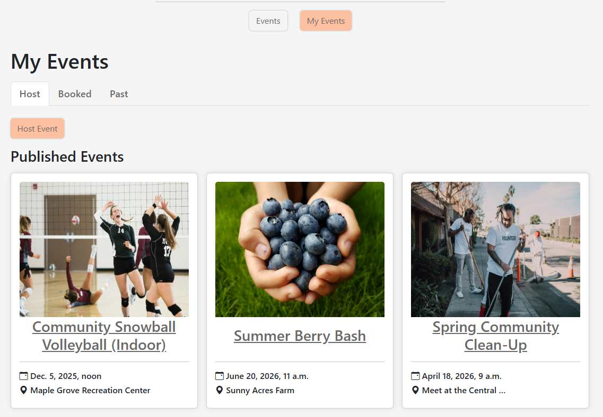 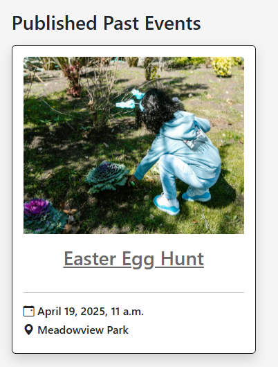 |
| My Events - Booked Tab | Show users booked events | 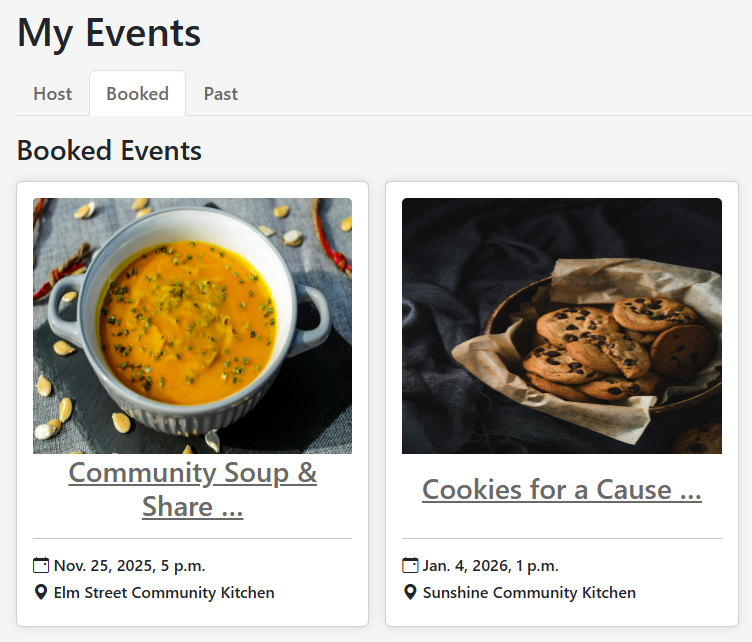 |
| My Events - Past Tab | Show users past booked events | 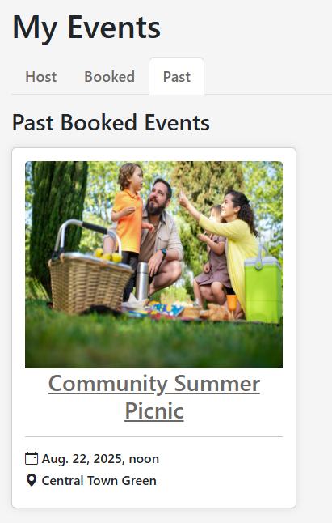 |
| My Events - Host Event | Users can host their own event | 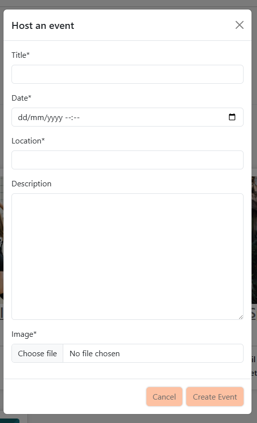 |
| My Events - Edit Event | Users can edit their event |  |
| My Events - Delete Event | Users can delete their hosted event | 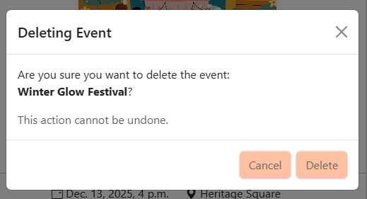 |

#### Validation

##### HTML
| Page | Image |
| :---: | :---: |
| Events | 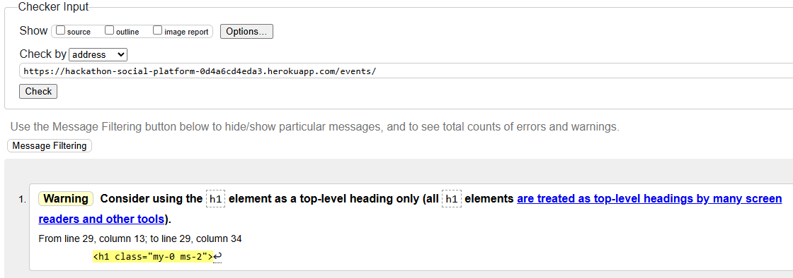 |
| Event detail | 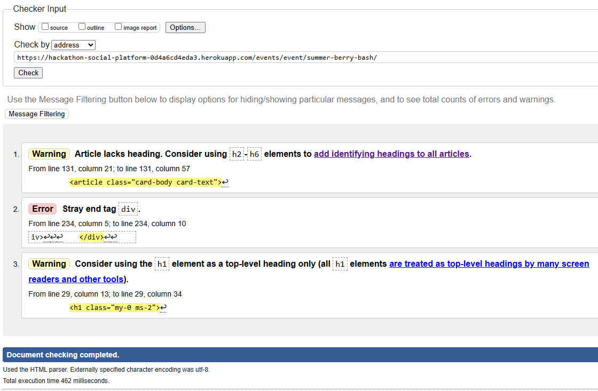 |
| My Events | 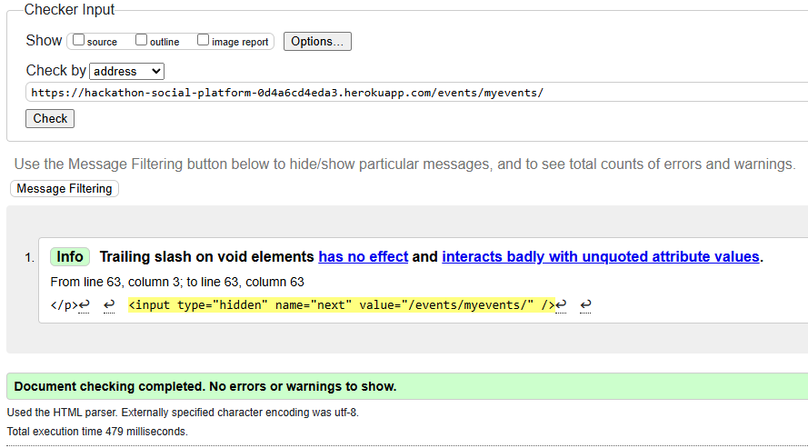 |

##### Python Linter
| File | Image |
| :---: | :---: |
| events/admin.py | 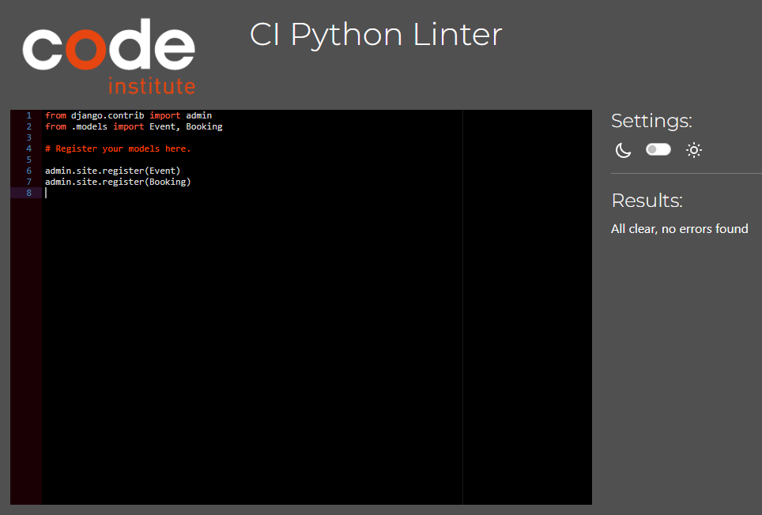 |
| events/forms.py |  |
| events/models.py | 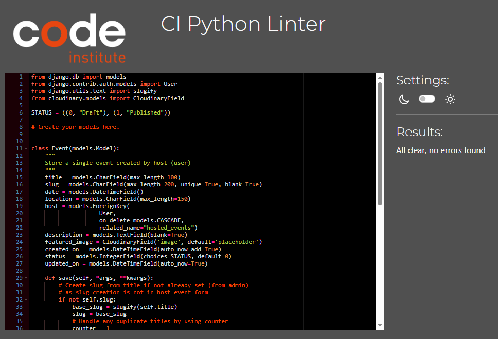 |
| events/tests.py | 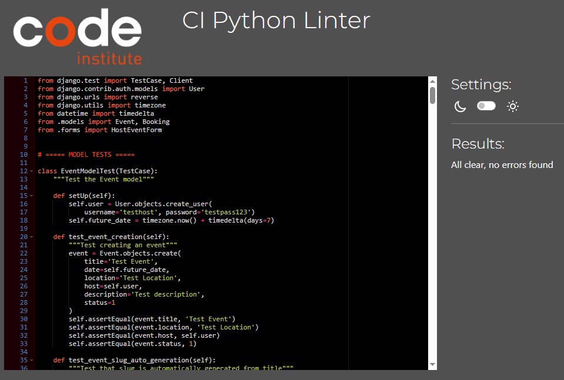 |
| events/urls.py |  |
| events/views.py | 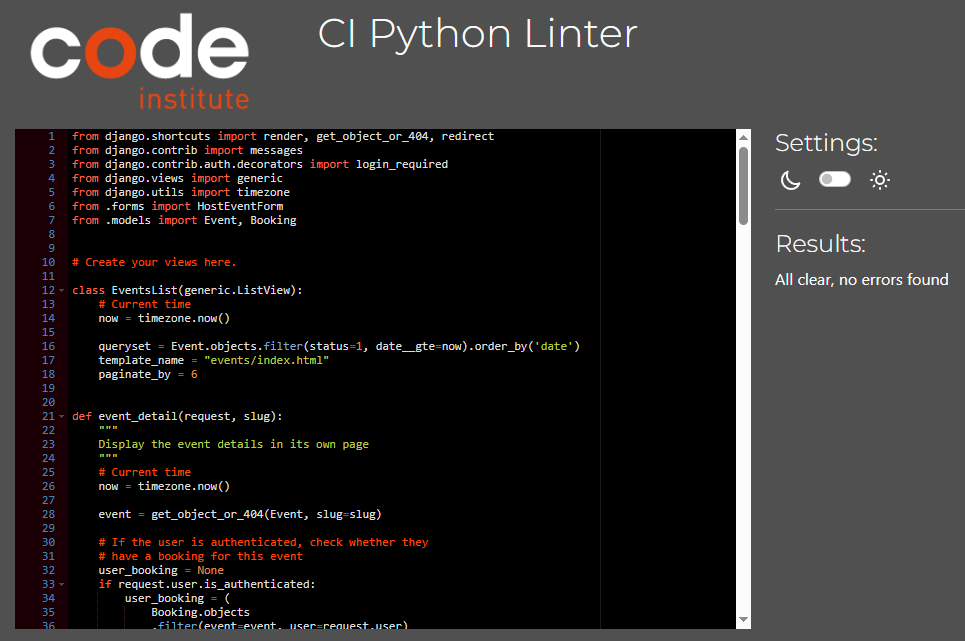 |

